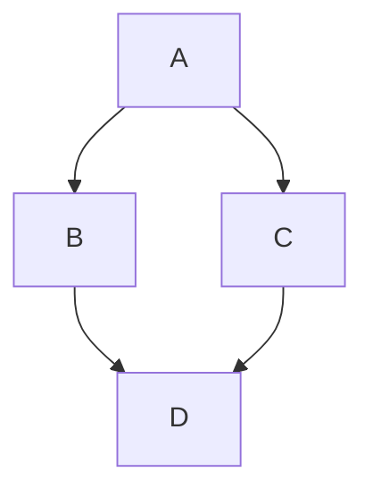

# Sample Markdown File — Comprehensive Formatting Test

> A single-file markdown sample that covers headings, lists, code, tables, images, links, emphasis, blockquotes, horizontal rules, footnotes, task lists, embedded HTML, math, and more.

## Table of Contents
- [Heading levels](#heading-levels)
- [Emphasis](#emphasis)
- [Line Breaks and Whitespace](#line-breaks-and-whitespace)
- [Abbreviations](#abbreviations)
- [Lists](#lists)
- [Tables](#tables)
- [Blockquotes](#blockquotes)
- [Horizontal rules](#horizontal-rules)
- [Footnotes](#footnotes)
- [Emoji and special characters](#emoji-and-special-characters)
- [Alerts](#alerts-github-specific)
- [Mermaid Diagrams](#mermaid-diagrams)
- [HTML blocks](#html-blocks)
- [Code Examples with Comments](#code-examples-with-comments)
- [Math (LaTeX)](#math-latex)
- [Advanced Math (LaTeX)](#advanced-math-latex)
- [Mixed content: headings, code, list combined](#mixed-content-headings-code-list-combined)
- [Accessibility notes](#accessibility-notes)
- [Sample YAML front matter](#sample-yaml-front-matter-for-static-site-generators)
- [Example of a collapsible/details block](#example-of-a-collapsibledetails-block-html)
- [Internationalization and special scripts](#internationalization-and-special-scripts)
- [Metadata block](#metadata-block-html-comment)
- [End of file](#end-of-file)

---

## Heading levels
# H1
## H2
### H3
#### H4
##### H5
###### H6

---

## Emphasis
*Italic text*  
_Also italic_  

**Bold text**  
__Also bold__  

***Bold + italic***  
~~Strikethrough~~  

H<sub>2</sub>O (subscript using HTML)  
E = mc<sup>2</sup> (superscript using HTML)  

Escaping special characters: \*not italic\* or \_not italic\_  

**Key:** **Bold**, *italic*, `inline code`

---

## Line Breaks and Whitespace

For line breaks within paragraphs, end a line with two spaces.  
Like this line.

You can also use HTML: <br> for a hard break.

Multiple spaces are collapsed, but `&nbsp;` preserves space.

---

## Abbreviations

*[HTML]: Hyper Text Markup Language

*[CSS]: Cascading Style Sheets

*[JS]: JavaScript

This is HTML, CSS, and JS.

---

## Lists

Unordered list:
- Apples
- Oranges
  - Mandarin
  - Blood orange
- Bananas

Ordered list:
1. Install dependencies
2. Run tests
3. Deploy

Nested ordered/unordered:
1. Step one
   - Subtask A
   - Subtask B
2. Step two
   1. Substep i
   2. Substep ii

Task list (GitHub-style):
- [x] Write sample file
- [x] Review formatting
- [x] Submit test

Definition list (using Markdown extension):
Term 1
: Definition for term 1

Term 2
: Definition for term 2
  Continued on another line

HTML definition list:
<dl>
  <dt>HTML Term</dt>
  <dd>HTML Definition</dd>
</dl>

---

## Tables

Basic table:

| Feature       | Supported | Notes                          |
|---------------|:---------:|--------------------------------|
| Headings      | ✅        | Levels H1–H6 shown             |
| Code blocks   | ✅        | Multiple languages             |
| Images        | ✅        | Markdown + HTML tested         |
| Tables        | ✅        | This table                     |

Alignment table:

| Left align | Center align | Right align |
|:-----------|:------------:|------------:|
| left       | center       |      right  |
| A          | B            |           C |

Complex table with code:

| Command        | Description                |
|----------------|----------------------------|
| `npm install`  | Install packages           |
| `npm test`     | Run tests                  |
| `docker run`   | Run container              |

Table with links:

| Site    | URL                          |
|---------|------------------------------|
| Google  | [Link](https://google.com)  |
| GitHub  | [Link](https://github.com)  |

Complex table with merged cells (using HTML):

<table>
  <tr>
    <th rowspan="2">Feature</th>
    <th colspan="2">Support</th>
  </tr>
  <tr>
    <th>Markdown</th>
    <th>HTML</th>
  </tr>
  <tr>
    <td>Tables</td>
    <td>✅</td>
    <td>✅</td>
  </tr>
  <tr>
    <td>Images</td>
    <td>✅</td>
    <td>✅</td>
  </tr>
</table>

---

## Blockquotes

> This is a blockquote.  
> It can span multiple lines.
>
> > Nested blockquote.

---

## Horizontal rules

---

***

___

---

## Footnotes

Here is a sentence with a footnote.[^1] And another one here.[^2]

[^1]: This is the footnote content. It can include **formatting** and links: https://example.com

[^2]: Second footnote with more details.

---

## Emoji and special characters

- Emoji: 😄 🚀 ✅ 🔍 📝
- Symbols: © ™ ® — —– ——— ± × ÷

---

## Alerts (GitHub-specific)

> [!NOTE]
> This is a note alert.

> [!TIP]
> This is a tip alert.

> [!IMPORTANT]
> This is an important alert.

> [!WARNING]
> This is a warning alert.

> [!CAUTION]
> This is a caution alert.

---

## Collapsible Section Example
<details>
  <summary>Click to expand additional tips</summary>
  
  - Use semantic HTML for better accessibility.
  - Test your markdown in multiple renderers.
  - Keep code blocks concise for readability.
</details>

---

## Mermaid Diagrams



---

## HTML blocks

<div style="border:1px solid #ccc; padding:8px;" role="region" aria-label="HTML block example">
  <strong>HTML block:</strong> You can include HTML for fine-grained control.
  <ul><li>Nested HTML list item A</li><li>Nested HTML list item B</li></ul>
</div>

HTML table example:
<table border="1" role="table" aria-label="Sample HTML table">
  <tr>
    <th>Header 1</th>
    <th>Header 2</th>
  </tr>
  <tr>
    <td>Data 1</td>
    <td>Data 2</td>
  </tr>
</table>

Sample cat image without alt text:


Sample cat image with alt text:


Embedded video (YouTube iframe):
<iframe width="560" height="315" src="https://www.youtube.com/embed/dQw4w9WgXcQ" title="YouTube video player" frameborder="0" allow="accelerometer; autoplay; clipboard-write; encrypted-media; gyroscope; picture-in-picture" allowfullscreen aria-label="Embedded YouTube video"></iframe>

---

## Code Examples with Comments

Fenced code block (JavaScript):
```javascript
// hello.js
// Define a function to greet a person
function greet(name) {
  // Log a personalized greeting to the console
  console.log(`Hello, ${name}!`);
}
// Call the greet function with 'DevToys' as the argument
greet('DevToys');
```

Fenced code block (Python):
```python
# calc.py
# Function to add two numbers
def add(a, b):
    # Return the sum
    return a + b

# Print the result of 2 + 3
print(add(2, 3))
```

Fenced code block (Rust):
```rust
// main.rs
// Main function
fn main() {
    // Print hello world
    println!("Hello, world!");
}
```

Fenced code block (Go):
```go
// main.go
package main

import "fmt"

// Main function
func main() {
    // Print hello world
    fmt.Println("Hello, World!")
}
```

Fenced code block (Java):
```java
// HelloWorld.java
public class HelloWorld {
    // Main method
    public static void main(String[] args) {
        // Print hello world
        System.out.println("Hello, World!");
    }
}
```

Fenced code block (C++):
```cpp
// main.cpp
#include <iostream>

// Main function
int main() {
    // Print hello world
    std::cout << "Hello, World!" << std::endl;
    // Return 0
    return 0;
}
```

Fenced code block (C#):
```csharp
// Program.cs
using System;

// Program class
class Program {
    // Main method
    static void Main() {
        // Print hello world
        Console.WriteLine("Hello, World!");
    }
}
```

Fenced code block (SQL):
```sql
-- Select query
SELECT name, age FROM users WHERE age > 18;
```

Fenced code block (HTML):
```html
<!-- index.html -->
<!DOCTYPE html>
<html>
<head>
    <!-- Page title -->
    <title>Example</title>
</head>
<body>
    <!-- Heading -->
    <h1>Hello, World!</h1>
</body>
</html>
```

Fenced code block (CSS):
```css
/* styles.css */
/* Body styles */
body {
    font-family: Arial, sans-serif;
    background-color: #f0f0f0;
}
```

Fenced code block (JSON):
```json
{
    // JSON object
    "name": "John Doe",
    "age": 30,
    "city": "New York"
}
```

Fenced code block (YAML):
```yaml
# config.yaml
name: John Doe
age: 30
city: New York
```

Fenced code block (TOML):
```toml
# config.toml
name = "John Doe"
age = 30
city = "New York"
```

Fenced code block (PHP):
```php
<?php
// index.php
// Variable assignment
$name = "John Doe";
$age = 30;
// Output
echo "Hello, $name!";
?>
```

Fenced code block (Ruby):
```ruby
# hello.rb
# Variable
name = "John Doe"
age = 30
# Output
puts "Hello, #{name}!"
```

Fenced code block (Swift):
```swift
// main.swift
// Variables
let name = "John Doe"
let age = 30
// Print
print("Hello, \(name)!")
```

Fenced code block (Kotlin):
```kotlin
// main.kt
// Variables
val name = "John Doe"
val age = 30
// Print
println("Hello, $name!")
```

Fenced code block (R):
```r
# script.R
# Variables
name <- "John Doe"
age <- 30
# Print
cat("Hello,", name, "!")
```

Fenced code block (Scala):
```scala
// Main.scala
object Main extends App {
  val name = "John Doe"
  val age = 30
  println(s"Hello, $name!")
}
```

Fenced code block (Diff):
```diff
- old line
+ new line
  unchanged line
```

Fenced code block (TypeScript):
```typescript
// app.ts
interface User {
  name: string;
  age: number;
}

const greetUser = (user: User): string => {
  return `Hello, ${user.name}! You are ${user.age} years old.`;
};

const user: User = { name: "Alice", age: 30 };
console.log(greetUser(user));
```

Fenced code block (Bash):
```bash
#!/bin/bash
# script.sh
echo "Current directory: $(pwd)"
echo "Files in directory:"
ls -la
echo "Disk usage:"
df -h
```

---

## Math (LaTeX)

Inline math: Euler's identity: $e^{i\pi} + 1 = 0$. Pythagorean theorem: $a^2 + b^2 = c^2$.

Display math:
$$
\int_{0}^{1} x^2 \, dx = \frac{1}{3}
$$

Another display math:
$$
\sum_{i=1}^{n} i = \frac{n(n+1)}{2}
$$

(If renderer doesn't support LaTeX, it should still show the raw delimiters.)

Advanced LaTeX:

Matrix:
$$
\begin{pmatrix}
a & b \\
c & d
\end{pmatrix}
$$

Complex integral:
$$
\int_{-\infty}^{\infty} e^{-x^2} \, dx = \sqrt{\pi}
$$

---

## Mixed content: headings, code, list combined

### Deploy checklist
1. Ensure tests pass:
```bash
npm test --silent
```
2. Build production assets:
```bash
npm run build --if-present
```
3. Tag release:
- Create tag: `git tag -a v1.0.0 -m "Release v1.0.0"`
- Push tags: `git push origin --tags`

---

## Accessibility notes
- Provide alt text for images.
- Use headings in order.
- Ensure sufficient contrast for any embedded HTML styles.

---

## Sample YAML front matter (for static site generators)
---
title: "Comprehensive Markdown Test"
date: 2025-10-01
tags:
  - markdown
  - test
---

---

## Example of a collapsible/details block (HTML)
<details>
  <summary>Click to expand</summary>
  
  - Hidden item 1  
  - Hidden item 2  

  ```json
  { "hidden": true, "items": 2 }
  ```
</details>

---

## Internationalization and special scripts

- English: The quick brown fox.
- Hindi (Devanagari): नमस्ते दुनिया
- Arabic (RTL): مرحبا بالعالم
- CJK: こんにちは世界 / 你好，世界

---

## Metadata block (HTML comment)
<!--
  Author: DevTester
  Purpose: Test rendering of markdown features in DevToys
-->

---

## End of file

Thank you — this file includes most common Markdown features to validate rendering in editors and tools.
